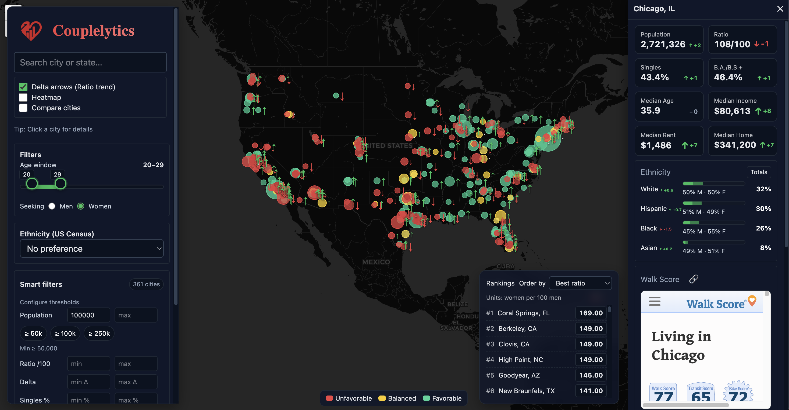

## 📸 Demo



# Couplelytics — UI (Code Only)

Couplelytics is a personal tool inspired by **singlesatlas.com**, rebuilt from the ground up with modern data and a refined UI. It helps explore and visualize patterns across U.S. cities related to dating‑relevant factors, providing insights through interactive maps and data-driven components. This repository contains the **frontend code**—React components, hooks, and shared TypeScript types.

## Overview

- React components and UI logic
- Shared TypeScript types
- Styling and layout with Tailwind CSS

## Exclusions

- Backend/API implementation
- Raw datasets
- Project-level tooling

## Purpose

This separation allows focused sharing of the UI work independently from backend logic and data.

## API & Backend Overview

The backend follows a layered design with clear separation of concerns. Routes handle requests, services handle logic and data access, utilities offer shared functions, and middleware handles cross‑cutting concerns like security and performance.

Responses are pre-shaped server-side to optimize performance. Timing logs track request durations.

### Simplified Request Flow

```
[Client UI]
   │  POST /api/cities
   ▼
[Routes] ──► [Services] ──► [Data Layer]
   │                        │
   ▼                        ▼
[Response] ◄───────────────┘
```

## Tech Stack

- React with TypeScript — component‑driven UI with type safety
- Leaflet — lightweight and flexible map rendering
- Tailwind CSS — rapid iteration and responsive design

## Project Structure

```
apps/ui/
  src/
    components/   # map, drawers, lists, controls
    hooks/        # debounced values, data loading hooks
    utils/        # small helpers
  public/         # static assets (icons, favicon)
shared/types/     # TypeScript interfaces used by the UI
```

## Implementation Notes

All displayed values are computed server-side; the UI is responsible solely for presentation and interaction.

## Author

Nathan Bradshaw — frontend development and data visualization. Backend and data remain private; this repository highlights the UI layer exclusively.
